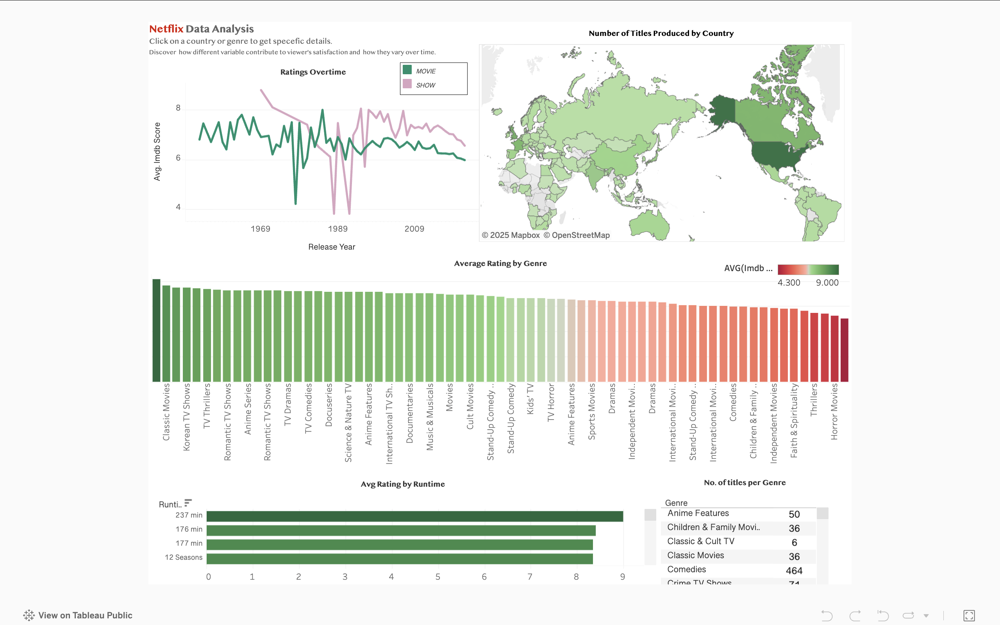

# Netflix Analysis-and Business Insights
A deep dive into Netflix's content and corresponding iMDB ratings for data analysis and business recommendations. 

## Project Overview

-  Explores Netflix’s **SaaS subscription** model and how content quality impacts churn, retention, and revenue.  
- Analyzes IMDb ratings across genres to uncover patterns in user satisfaction and engagement.  
-  Delivers business-focused recommendations supported by Python analysis, Tableau dashboards, and industry research.

  ## Project Deliverables
  
- **Python Jupyter Notebook** - [analysis.ipynb](notebooks/Netflix_Portifolio.ipynb)  
- **Notebook (HTML Export)** - [analysis.html](notebooks/Netflix_Portifolio.html)  
- **Business Recommendations Report** - [recommendations.pdf](reports/recommendation.pdf)  
- **Interactive Dashboard (Tableau)** - [View Dashboard](https://public.tableau.com/shared/M2N53BDWP?:display_count=n&:origin=viz_share_link)  
- **Reference Paper** - [Netflix Research Paper](reports/paper)  

---

##  ROI (Return on Investment)  

By prioritizing high-quality, multi-season shows and tailoring investment by genre:  
- **Churn Reduction:** Estimated 2–3% fewer cancellations.  
- **Revenue Impact:** Potential +$XXM annual revenue (based on churn calculations).  

---

##  Key Insights  

- **Quality over Quantity:** Shows with more seasons receive higher IMDb ratings, which correlates with user satisfaction and retention.  
- **Genre-Specific Strategies:** Different genres perform better with different season lengths. Example: Korean dramas peak with fewer seasons, while Docuseries and Classic/Cult shows benefit from longer runs.  
- **Business Impact:** Better retention → fewer cancellations → higher lifetime revenue per customer.  

---

## 🛠️ Tools Used  

- **Excel and Python (pandas, matplotlib, seaborn)** for Data cleaning & visualization  
- **Tableau** for Interactive dashboard creation  
- **MS Word / PDF** for the Final recommendations report  

---

## 📷 Visuals  

  

---

## 📂 Data
Data was collected from kaggle's website. Csv files included for a deeper dive:
[Data](Data)

